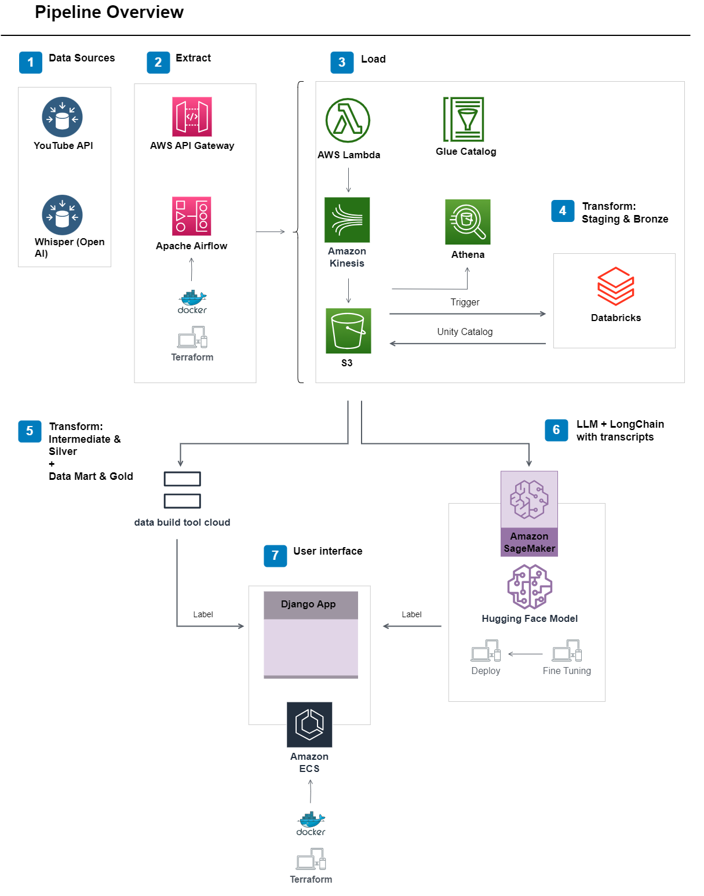

# End-to-End Data engineer project

<!-- imagem de capa do projeto -->

# Introduction & Goals
 
 Hello! My name is Andre Ichiro and this project represents my journey in the realm of data engineering. The project leverages the YouTube API and Whisper transcriptions to provide video insights to data analysts through a data mart layer. Additionally, the transcriptions are used to train a Large Language Model (LLM) and longchain to answer and reproduce video contents. 

- Goals
  - Enable companies to develop a data strategy through an ELT (Extract, Load, Transform) approach;
  - Develop an automated data pipeline using a modern data stack that incorporates DevOps, Infrastructure as Code, containerization, testing, and data lakehouse;
  - Assist students in course forums by answering their questions or generating synthetic data to help teachers develop classes;
  - Fine-tune a LLM using customized data from video lessons;
  - To demonstrate my skills in data engineering;

- Overall

The pipeline functions as expected, and the results are displayed in the samples folder, as well as you can find data in the 'data' folder.

 - Project Structure

 To navigate through this project's folder structure, refer to the following sections:

    - handlers-airflow: contains code for terraform, ansible, airflow, docker-compose;   
    - databricks: contains code for Spark and Spark SQL;
    - application: contains code for terraform ECS, docker and Django application;
    - app_dbt: contains code for dbt cloud;
    - aws: contains code for AWS services such as AWS Glue, AWS Lambda, AWS Gateway, S3 trigger's and Kinesis;
    - samples: provides samples from the aforementioned services; 
    - data: includes video content in different stages (raw, staging, intermediate, and data mart);

<!-- diagrama do pipeline -->

      
# Contents

- [The Data Set](#the-data-set)
- [Used Tools](#used-tools)
- [Pipelines](#pipelines)
- [Demo](#demo)
- [Conclusion](#conclusion)
- [Follow Me On](#follow-me-on)
- [Appendix](#appendix)

# The Data Set

- Data

The dataset consists of the following components:  

  - Transcripts

    Stored as Parquet files, these files require downloading the YouTube videos and running Whisper to generate transcriptions. Organizing all the transcriptions is necessary for training the LLM;
    
  - YouTube Data

    Represented as JSON files, containing video id, channel title, description, views, likes, favorites and comments counts, date and duration;

- Dataset Selection

  This dataset was chosen for several reasons:

  - Uniqueness
 
    As a dataset created specifically for this project, it allows for practicing data modeling;
    
  - Variety
 
    Working with different file formats and nested dictionaries provides valuable experience;
    
  - Realistic Business Problem
 
    The dataset simulates a genuine business problem, allowing for practical skill application;

- Objectives

  The objectives with this dataset are as follows:

  - Implement multiple Common Table Expressions (CTEs) to enhance the data mart experience; 
  - Perform 1st, 2nd, and 3rd normalizations to ensure data integrity;
  - Utilize a Snowflake schema to organize facts and dimensions effectively;
  - Serve the transformed data to provide insights to end-users;
  - Use the transformed data to train an LLM with longchain;

# Used Tools  

- Motivation

  This project aimed to simulate a modern data stack, showcasing some familiarity in various technologies and skills relevant to a data engineer role.
  
- Stack

  - Terraform, Docker, Docker-Compose, Ansible, Github Actions; 
  - Multiple AWS Services - Glue, Kinesis, ECS, Athena, API Gateway, SageMaker (as well as load-balancers, subnets and so on) - in an event-driven architecture;
  - Databricks, Pyspark and Spark SQL;
  - Python, Pandas, Databases and Django;
  - Airflow;
  - dbt cloud;
  - API;
  - Whisper (OpenAi);
  - LLM, fine-tuning;
  - Data modeling, Medallion architecture, normalizations;
  - Design patterns (such as factory), Python abstract classes, problem-solving with Python;

- More specifically, the following technologies were utilized throughout the project:

  - Terraform: Provisioned infrastructure as code, enabling efficient and reproducible deployment. Combined with Ansible and Docker, it facilitated dependency installation;

  - Docker Compose: Used to initiate Apache Airflow for scheduling and orchestration. Airflow DAGs run a Python script to extract data from the YouTube API using an factory design pattern;
  
  - AWS Services: Leveraged multiple AWS services such as API Gateway, Lambda, Athena, and Kinesis for data ingestion, storage, and transformation. S3 triggers were set up to activate the staging layer in Databricks upon data arrival;

  - Airflow: Orchestrated the data pipeline extraction process, running Python, Pandas, and Spark to extract video metadata, format, and upload it to S3;

  - Databricks, Spark, and Spark SQL: Employed for data transformation and data model creation. Flattening nested JSONs, identifying nulls and duplicates, enforcing schema, and testing functions using pytest were some of the tasks performed. Data was saved in multiple formats in S3;

  - dbt (Data Build Tool): Utilized for the intermediate and data mart layers, enabling the implementation of CTEs, normalizations, and a Snowflake schema. Source freshness testing, surrogate key construction, and data transformation were performed to provide insights to end-users;
  
  - Django Application in AWS ECS: Developed using Terraform and Docker as infrastructure as code. GitHub Actions ensured compatibility testing of the Django application across multiple operating systems, resulting in a thoroughly tested application. This Django application is the back-end for inference with the fine-tuned LLM with longchain to answer questions;

# Demo
A demonstration video showcasing the project is currently under progress as I am incorporating Amazon Sagemaker with Hugging Face and deploying it within our Django application that runs on Amazon ECS with a streamlit front-end.

# Conclusion
Throughout this project, several learning opportunities and challenges were encountered, testing fundamental technical skills for a data engineer. 

- Key highlights include:

  - Integration of different technologies, requiring extensive testing, research, and debugging;
  - Database building and modeling, which proved to be a challenging task requiring critical thinking and experimentation;
  - Acquisition of knowledge in Spark and Terraform through various learning sources, such as courses, books, and Stack Overflow;
  
- Remaining tasks

  The following tasks are yet to be completed:

  - Implement AWS Sagemaker and Hugging Face models using peft techniques;
  - Develop an alternative version using Glue ETL, Athena and Snowflake;
  - Integrate Power BI, Tableau, or Looker for dashboard visualization about the model's performance;

- Future improvements

  To further enhance this project, the following improvements can be made:

   - Create a Django REST API to enable real-time inference anywhere;
  - Enable streaming with Spark, utilizing overlapping windows and Kafka;
  - Explore data mesh and data contracts as potential enhancements;
  - Incorporate a paralell MlOps pipeline;

# Let's connect

Connect with me on [LinkedIn](https://www.linkedin.com/in/andré-ichiro-82592327) 

# Appendix

Refer to the [Markdown Cheat Sheet](https://github.com/adam-p/markdown-here/wiki/Markdown-Cheatsheet) for assistance with markdown.
